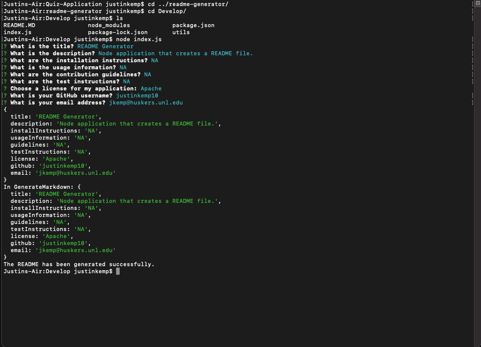

# README Generator

## The Task
Create a command-line application that dynamically generates a professional README.md file from a user's input using the inquirer package.

## Acceptance Criteria
1. When the user runs the application from the command-line they are prompted to input information about their application repository.
2. When the user finishes inputing their information, then a high-quality, professional README.md is generated.
3. When the README is generated the title of the project, description, table of contents, installation, usage, license, contributing tests, and questions all appear.
4. When the user selects the license then a badge for that license appears at the top of the README and a notice is added to the section of the README entitled License.
5. When the user enters their GitHub username and email address, then that information should appear in the section of the README entitled Questions.
6. When I click on the links in the table of contents, then I am taken to the corresponding section of the README.

Here is a link to the application repository: [README Generator](https://github.com/justinkemp10/readme-generator)